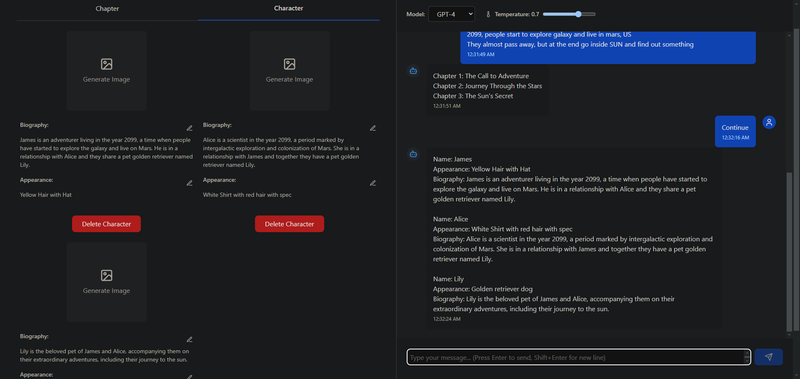

# Story Teller

A full-stack application for creating and managing interactive stories with AI-powered image generation.

## Features

- User authentication (Register/Login)
- Story creation and management
- AI-generated story illustrations
- Chapter-based story development
- Character profile generation
- Interactive story outlining

## Tech Stack

**Frontend:**

- React.js + Vite
- Tailwind CSS
- Axios (API calls)

**Backend:**

- Django REST Framework
- Python
- MySQL Database

**AI Services:**

- OpenAI API
- DALL-E Image Generation (OpenAI)

## Prerequisites

- Node.js (v18+)
- Python (3.9+)
- MySQL Server (8.0+)
- Pipenv
- Git

## Installation

### 1. Clone Repository

```bash
git clone https://github.com/yourusername/story-crafting-platform.git
cd story-crafting-platform
```

### 2. Frontend Setup

```bash
cd frontend
npm install
```

### 3. Backend Setup

```bash
cd ../backend
pipenv install
```

## Database Configuration

1. Create MySQL Database:

```sql
CREATE DATABASE story;
CREATE USER 'root'@'localhost' IDENTIFIED BY 'root';
GRANT ALL PRIVILEGES ON story.* TO 'root'@'localhost';
FLUSH PRIVILEGES;
```

2. Update Django Settings:

```python
# backend/settings.py
DATABASES = {
    'default': {
        'ENGINE': 'django.db.backends.mysql',
        'NAME': 'story',
        'USER': 'root',
        'PASSWORD': 'root',
        'HOST': 'localhost',
        'PORT': '3306',
    }
}
```

3. Run Migrations:

```bash
pipenv shell
python manage.py makemigrations
python manage.py migrate
```

## Running the Application

### Start Frontend Server

```bash
cd frontend
npm run dev
```

### Start Backend Server

```bash
cd ../backend
pipenv shell
python manage.py runserver
```

Access the application at `http://localhost:5173` (frontend) and `http://localhost:8000` (backend)

## Environment Variables

Create `.env` files for backend with necessary secrets:

**backend/core/.env**

```env
OPENAI_API_KEY=xxxxxxxxxxxxxxxxxxxxxxxxxxxx
LANGCHAIN_TRACING_V2=true
LANGCHAIN_ENDPOINT="https://api.smith.langchain.com"
LANGCHAIN_API_KEY="xxxxxxxxxxxxxxxxxxxxxxxxxxxx"
LANGCHAIN_PROJECT="xxxxxxxxxxxxxxxxxxxxxxxxxxxx"
```

## Project Demo Walkthrough

1. **Register a new user**

   

2. **Login with the registered user**

   

3. **Navigate to home page**

   

4. **Create a new story**

   

5. **View the created story**

   

6. **Generate Image for the story**

   

7. **Image generated**

   
   
8. **Enter story prompt**

   

9. **Answer Interview Question**

   

10. **Generate Story Outline**

   

11. **Generate Character**

   

12. **Generate Character Image**

   

13. **Generate the story chapter**

    

    

    

    

